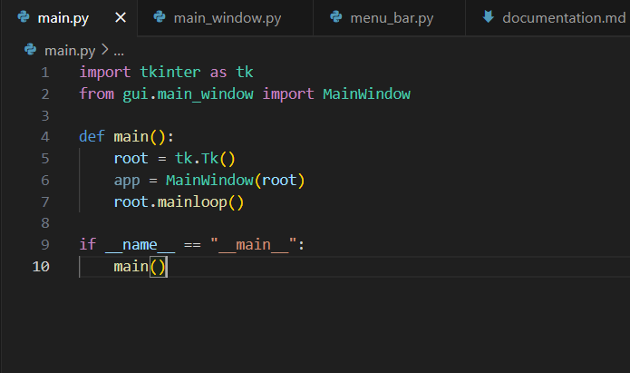
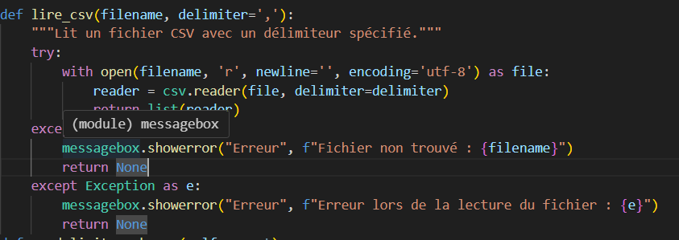

Voicie le main.py qui permet de demarrer le programmme du projet

####
Cette fonction lire_csv a pour rôle de lire un fichier CSV (Comma Separated Values) et de traiter les données qu'il contient.

